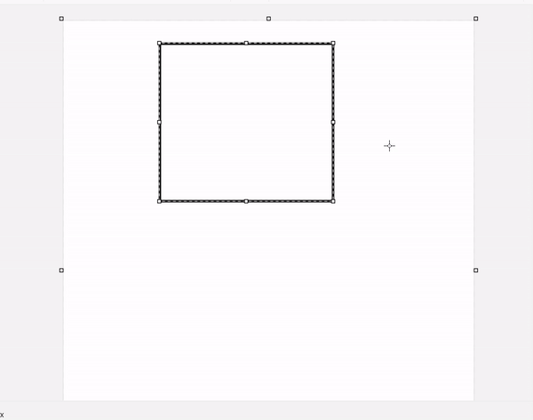

# How I have done the **Drag and Drop** functionality

Before we go to the explanation on how I made my Drag and Drop functionality let us first go to the meaning of Drag and Drop - Drag and Drop is a feature of a program / website where a user can DRAG a particular item by either pressing it and holding the mouse with the mouse or touching it and holding with the touch in any device that has touching functionality and then can DROP it by releasing the hold.

There are diffrent version of a Drag and Drop one version is that , a user can drop the item anywhere they wanted to.

## Drag and Drop anywhere version (this is just a made up name for this version) 
;

> As shown in the video above , the Drag and Drop anywhere version you can drop item everywhere,
like the new rectangle we made we can drop it anywhere , like on the top of the other rectangle burying it.

### The version I used in my Drag and Drop is what I call Drag and Drop with holders (again just a name I come up with)

**Like what is shown in the video below**

;

> In this version you can't drop the item anywhere , like what is shown in the video when we attempt to drop the file to the other file it doesn't allow us to place it , there it was place in other area.  
That particular area where our file was drop is what I call **Holder** , A holder is an area where a particular item could be place, you could think of the holder like in a tray the egg holder , or where the egg could be place. There is a specific area where the item are allowed to be place.

## Now after explaining what is a Drag and Drop and its version lets now move to "When to use a Drag and Drop" 
You can see Drag and Drop feature in a particular program and website, Drag and Drop is used when you wanted to make it easier to place a particular item in particular area , like in a editing tool.
#### --NOTE TO MY SELF ADD MORE EXPLANATION IN THIS AREA.

## NOW we move to How I made the Drag and Drop

### The overview of what I have done is 
- #### Specify what are the items of the target container we wanted to have drag and drop.
- #### Create the holders.
- #### Setup the items.
- #### Add the functionalities